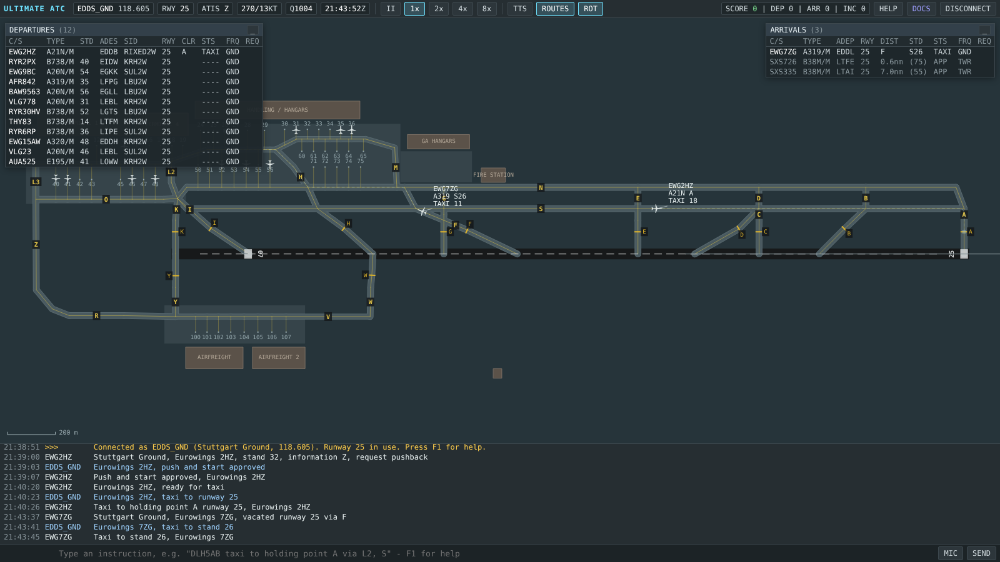

# Ultimate ATC

**Ultimate ATC** is an air traffic control simulator that runs in your browser. It aims to come as close as possible to [EuroScope](https://www.euroscope.hu/), the radar client used on the [VATSIM](https://vatsim.net/) network. You log in to a controller position at a real airport, and AI pilots respond to your instructions in ICAO phraseology, whether you type them or speak them.

> **Status: early development (v0.7).** Three positions are playable at **Stuttgart (EDDS)**: **Delivery**, **Ground** and **Tower**, each alone or combined. The code is built so that more positions (Approach/Departure, Center) and more airports (EDDF, EGLL, KLAX, KSAN, ...) can be added later. See the [roadmap](docs/roadmap.md).



## Features

- **EuroScope-style ground radar:** a dark scope with runways, taxiways, holding points, stands and buildings. Each aircraft has a symbol at real size and a data tag you can drag. **Tag items are clickable**, and the scope can be shown **runway-aligned like the aerodrome chart** (default) or north-up: callsign (flight plan and radiotelephony callsign such as `SPEEDBIRD 947`), cleared-to (taxi menu) and status (aircraft menu). Zoom, pan, and the **departure and arrival lists** work as in EuroScope.
- **Logging in like on VATSIM:** choose the airport, position(s) and traffic density. You then work as `EDDS_GND` on 118.605 "Stuttgart Ground", `EDDS_DEL` on 121.915 "Stuttgart Delivery", `EDDS_TWR` "Stuttgart Tower", or several at once (**combined positions**). Positions you don't staff are run by the simulator.
- **Tower:** line-up, take-off and landing clearances (`behind landing EWG7TK, line up and wait behind`, `wind 250 degrees 8 knots, runway 25, cleared for take-off`), go-arounds, exits, runway crossings, hand-offs to Radar and Ground, an arrival sequence and departure-spacing hints; arrivals without a landing clearance go around, take-offs with too little spacing count as separation losses.
- **Clearance Delivery:** IFR clearances (`cleared to Frankfurt via KRH2W departure, climb 5000 feet, squawk 2312`) with readbacks to check (crews sometimes read back a wrong squawk), start-up at the **A-CDM TSAT**, **CTOT** slots, and **datalink clearances (DCL)** sent from the list.
- **Systems window** (`SYSTEMS` / F3): status of the airport's systems with on/off switches - **A-SMGCS** (surveillance, runway monitoring RMCA, conflicting-clearance alerts CATC, routing service), **A-CDM**, **DCL** and the **ILS** (localizer, glide path). Switch one off to train working without it. See [docs/systems.md](docs/systems.md).
- **Ground vehicles:** tug drivers ask Ground for **tows** to remote stands (`request tow ... from stand 14 to stand 45` - `tow approved via ...`); crews can ask for a **follow-me**, a car that drives out and leads them to the stand. Vehicle tracking (ADS-B squitter) in the systems window decides whether vehicles get a label.
- **Head-on conflicts handled like in reality:** the A-SMGCS warns before you transmit a route that meets other traffic head-on, and *Resolve conflict* offers the way out: turn one aircraft off via a junction, or call a tug (5-10 minutes).
- **ATIS editor:** set the runway in use, wind, QNH and information letter during the session. A runway change re-plans departures and arrivals.
- **ICAO phraseology parser:** type `DLH5AB taxi to holding point A via L2, S` or `Lufthansa five alpha bravo, push and start approved, facing east`. It also understands:
  - conditional clearances: `behind the A320 passing from left to right, ...`,
  - queue positions: `CFG11, number 2 for pushback`,
  - incomplete taxi instructions: `taxi via N, hold short of F`,
  - intersection departures, asked like in real operations: `advise able for departure from intersection D`,
  - `cancel pushback` (a moving aircraft is towed back to the stand) and more.

  The callsign can be an ICAO code, a radiotelephony callsign, or left out (the selected aircraft is used). Several instructions can be combined in one transmission.
- **Airport briefing** (`BRIEFING` / help window): your job at the position, the runway in use with its entries, exits and taxi flows, typical routes, stands, hot spots and frequencies - for every airport.
- **Settings menu** (`SETTINGS` / F2) with live changes: **mobile or PC layout** (phone-laptop slider), interface and tag size, scope orientation, voices, recognition accent, traffic density and special events.
- **Mobile mode (optimised for the iPad):** + / - zoom buttons, smooth one- and two-finger pan/zoom without page scrolling, tap once to select and again for the menu (or long-press), a quick-action bar (push, taxi, hold, resolve, continue, contact Tower; clearance, start-up and contact Ground on Delivery), larger touch targets.
- **Live preview:** while you type, the command line shows how the instruction was understood. The taxi route is drawn on the scope before you transmit.
- **Right-click menus:** pushback (with facing), taxi to a holding point or stand (with an automatic route), hold position, continue, hold short, cross runway, give way, and contact Tower.
- **AI pilots:**
  - They call for pushback and taxi, report vacating, and read every instruction back.
  - They reply "unable" or "say again" when an instruction is wrong, and call again if you don't answer.
  - They keep visual separation on the ground (they stop behind other traffic, give way at crossings) and report when they are stuck.
  - Airliners can't turn around on a taxiway: routes that need a 180 degree turn are refused, unless the aircraft is stuck and calls a tug.
- **AI Tower** with a [researched separation model](docs/tower-operations.md): departure, wake turbulence and runway separation, line-up behind landing or departing traffic, and departure gaps between arrivals. It lines up and launches the departures you hand over (and moves on or sends back departures you handed over short of the holding point), lands arrivals and picks an exit, and sends arrivals around if the runway is blocked.
- **Special events** (rare, can be switched off): medical emergencies (PAN PAN) and rejected take-offs.
- **Safety nets:** collisions, runway incursions and go-arounds are detected and counted against your score.
- **Voice (optional):**
  - Pilots can speak their transmissions (text-to-speech, each pilot with their own voice).
  - You can talk to them with push-to-talk speech recognition (Chrome/Edge). It is built for **voice-only operation**: the best of several recognition alternatives is used, callsigns are matched even when slightly misrecognised, typical recognition errors are corrected, and pilots stay quiet while you transmit.
- **Training scenarios:** a [scenario builder](docs/scenarios.md) creates shareable scenario codes (and links) for what you want to train: departure push, arrival rush, more heavies, a fixed runway, and emergencies, rejected take-offs or a wind shift at chosen minutes. The same code always gives the same session.

## Quick start

You need [Node.js](https://nodejs.org/) 20 or newer.

```bash
git clone https://github.com/linoking09/ultimate-atc.git
cd ultimate-atc
npm install
npm run dev        # open the printed URL (default http://localhost:5173)
```

Other scripts:

| Command             | What it does                                                  |
| ------------------- | ------------------------------------------------------------- |
| `npm run dev`       | Development server with hot reload                            |
| `npm run build`     | Type-checks and builds the static site into `dist/`           |
| `npm run preview`   | Serves the production build locally                          |
| `npm test`          | Runs the unit and scenario tests (Vitest)                     |
| `npm run typecheck` | TypeScript type check only                                    |

The build is a fully static site. It is deployed to GitHub Pages automatically; see [Getting started](docs/getting-started.md#deploying-to-github-pages).

## Your first minutes as Stuttgart Ground

1. Press **Connect** with the default settings: EDDS, Ground, medium traffic. The runway in use follows the wind (usually 25); click `ATIS` in the toolbar to change it.
2. A departure calls: `Stuttgart Ground, Lufthansa 5AB, stand 14, information E, request pushback`. The row flashes in the departure list and on the scope.
3. Answer with `DLH5AB pushback approved facing east`. You can also press **Tab** to select the caller and type only `push and start approved`, or right-click the aircraft.
4. When it reports `ready for taxi`, send it to the runway: `taxi to holding point A via M, H, N` (runway 25; after a pushback facing east).
5. When it reaches A, hand it to Tower: `contact tower 118.805`. Tower lines it up and it takes off.
6. Arrivals call after vacating the runway, for example `vacated runway 25 via E`. Taxi them to a stand: `taxi to stand 14 via S, H, M`. The suggested stand is shown in brackets in the arrival list.

Press **F1** in the app for the in-game reference.

## Documentation

| Document                                     | Contents                                                                    |
| -------------------------------------------- | --------------------------------------------------------------------------- |
| [Getting started](docs/getting-started.md)   | Installation, browsers, building, deployment                                |
| [User guide](docs/user-guide.md)             | Screen layout, scope, lists, tags, menus, keyboard, voice, scoring          |
| [Phraseology reference](docs/phraseology.md) | Every instruction the parser understands, pilot read-backs and calls        |
| [Airport: EDDS Stuttgart](docs/airports/EDDS.md) | Layout, taxiways, holding points, stands, typical routes, frequencies    |
| [Scenarios and seeds](docs/scenarios.md)     | What the seed does, scenario codes, the scenario builder, presets            |
| [Simulation model](docs/simulation.md)       | How AI pilots, AI Ground and Tower, Delivery and A-CDM, traffic generation, separation, special events and incidents work |
| [Airport and ATC systems](docs/systems.md)   | The systems window: A-SMGCS, A-CDM, DCL - what they do in reality and in the simulator |
| [Tower operations](docs/tower-operations.md) | Research: how tower controllers run a mixed-mode runway, separation minima, sources |
| [Architecture](docs/architecture.md)         | Code structure, data flow, how to add positions and multiplayer             |
| [Airport data format](docs/airport-data.md)  | How airports are described and how to add a new one                         |
| [Roadmap](docs/roadmap.md)                   | What is planned next, the proposed criteria for version 1.0                 |
| [Benchmarks](docs/benchmarks.md)             | Release benchmark, results per version, simulated traffic, major release statistics |
| [Glossary](docs/glossary.md)                 | Terms used in the simulator and the docs (deadlock, gridlock, TSAT, CTOT ...) |
| [Contributing](docs/contributing.md)         | Development workflow, conventions, tests                                    |
| [Changelog](CHANGELOG.md)                    | Release history                                                             |

## Data accuracy

The EDDS layout (taxiways, holding points, stand numbers, aprons) was **digitised by hand from the AIP Germany aerodrome charts** (AD 2 EDDS 2-5 and 2-7). The accuracy is about ±10 m, and some areas (de-icing pads, GA apron, US airfield) are simplified. Runway end coordinates come from [OurAirports](https://ourairports.com/) (public domain). The SIDs in the flight plans are placeholders. **Never use this simulator for real-world navigation or flight planning.** The [EDDS page](docs/airports/EDDS.md) describes exactly what is approximated.

## License

The source code is released under the [MIT License](LICENSE). Airport data derived from OurAirports is public domain.

## Disclaimer

Ultimate ATC is an independent hobby project. It is not affiliated with EuroScope, VATSIM, DFS or any airport or airline. Airline names and callsigns are used only to create realistic radio traffic.
